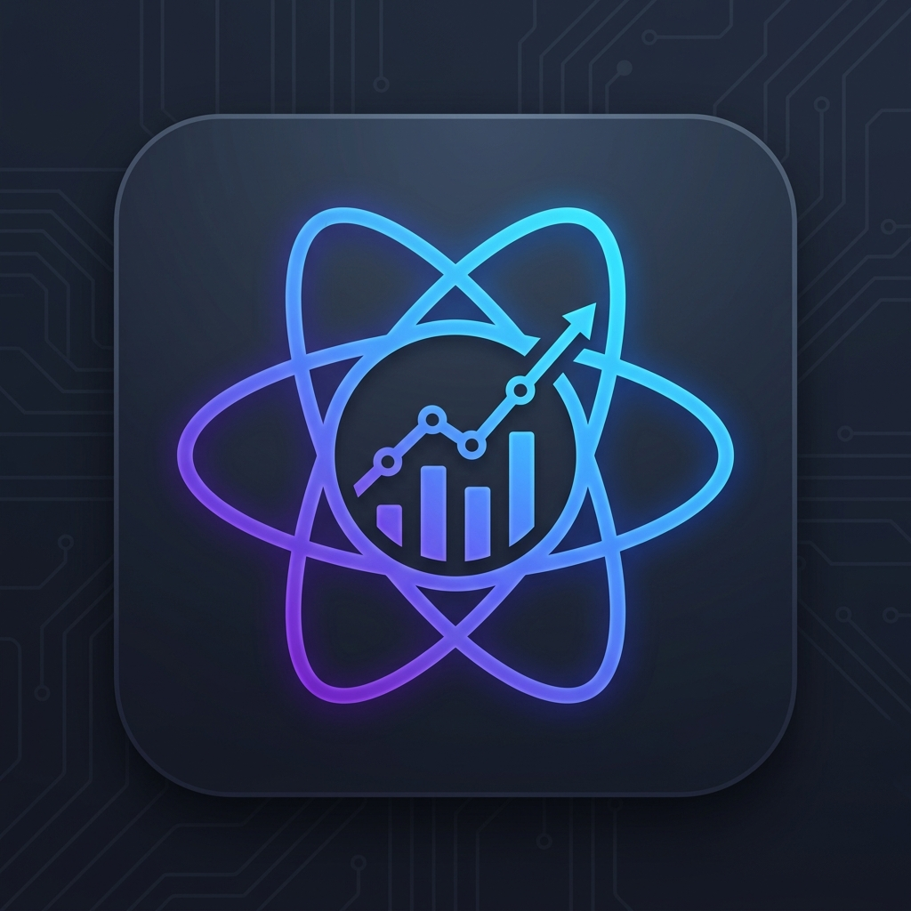

# React State Visualizer 🚀

Visualize your React component's state (`useState`, `useReducer`) directly in your VS Code sidebar with a premium, interactive dashboard.

## Features

- **🔍 Automatic State Detection**: Real-time AST scanning for `useState` and `useReducer`.
- **📊 Interactive Dashboard**: A sleek, glassmorphic UI to manage and track your states.
- **📍 Jump to Code**: Click any state in the sidebar to immediately navigate to its declaration in your source code.
- **📜 State History**: Track the timeline of your state scans throughout your session.
- **⚠️ Smart Alerts**:
    - **Unused State**: Identifies states that are declared but never referenced.
    - **Infinite Loop Warning**: Detects potential `setState` calls that might cause render loops.
- **🎨 Modern Aesthetics**: Designed with dark mode, glassmorphism, and smooth micro-animations.

## How to Use

1.  Open any React project.
2.  Navigate to the **React State** icon in the Activity Bar (Sidebar).
3.  Open a React component file (`.js`, `.jsx`, `.ts`, `.tsx`).
4.  The dashboard will automatically sync and display all states found in the active editor.
5.  Click on any state card to jump to its location in the code.

## Extension Settings

This extension currently does not require any additional configuration. It works out of the box with standard React Hooks.

## Requirements

- VS Code version 1.75.0 or higher.
- A React-based project with functional components.

## Known Issues

- Currently limited to functional components (Hooks). Class-based `this.state` is not supported yet.
- Real-time *runtime* values (actual data in the browser) are not yet displayed (static analysis only).

## Release Notes

### 1.0.2
Initial release of React State Visualizer.

---

**Enjoying the extension?** Give it a star on the Marketplace!
Made with ❤️ by Shuvroto Kumar.
